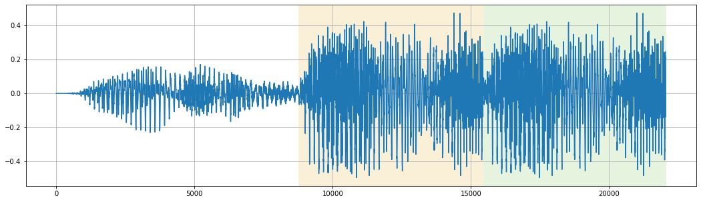
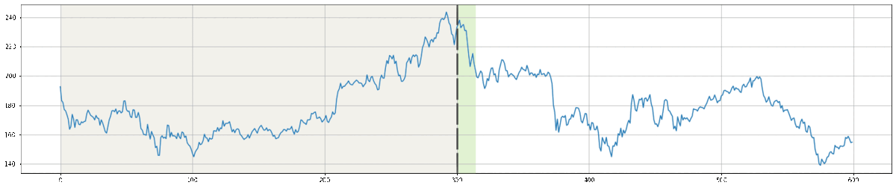

Обработчики
+++++++++++

.. _image:

Изображения
===========

.. note::
    При чтении одноканальные изображения автоматически переводятся в трёхканальные.

width
------
Целочисленное значение ширины картинки при создании массивов.

height
------
Целочисленное значение высоты картинки при создании массивов.

network
-------
.. На выбор доступно два режима - ``Convolutional`` и ``Linear``.

Режим ``Convolutional`` не предполагает никаких операций с полученным после чтения изображения массивом.

Режим ``Linear`` предполагает перевод массива изображения в векторное представление.
Например, трёхканальное изображение 100х100 из массива с размерностью (100, 100, 3) превратится в (30000,).

.. image:: images/изображения_сеть.png
    :alt: изображения_сеть.png

.. note::
    После перевода массивов изображения в векторное представление нельзя будет использовать сверточный слой в качестве первого слоя в нейронной сети.

.. _imageMode:

process
-----------------
Режим ``Stretch`` подгоняет исходное изображение под заданную высоту и ширину, не сохраняя её пропорции.

Режим ``Fit`` подгоняет исходное изображение под заданную высоту и ширину с сохранением пропорций исходного изображения.
Если заданные параметры высоты или ширины оказались больше исходного изображения, лишнее пространство изображения заполняется чёрным цветом.

Режим ``Cut`` подгоняет исходное изображение под заданную высоту и ширину, обрезая невошедшее в рамки заданной ширины и высоты исходя из центра изображения.
Если исходное изображение оказалось меньше заданной высоты и ширины, или одна из её сторон оказалась меньше, лишнее пространство изображения заполняется чёрным цветом.

.. list-table:: Режимы изображения. Размер обработанных картинок - 500х500px
    :widths: 300, 300, 300
    :header-rows: 1

    * - Растянуть
      - Вписать
      - Обрезать

    * - .. figure:: images/изображения_цветок_растянуть.png
          :alt: изображения_цветок_растянуть.png
          :align: center

          Оригинал - 300х200px

      - .. figure:: images/изображения_цветок_вписать.png
          :alt: изображения_цветок_растянуть.png
          :align: center

          Оригинал - 300х200px

      - .. figure:: images/изображения_цветок_обрезать.png
          :alt: изображения_цветок_растянуть.png
          :align: center

          Оригинал - 300х200px

    * - .. figure:: images/изображения_жираф_растянуть.png
          :alt: изображения_цветок_растянуть.png
          :align: center

          Оригинал - 600х950px

      - .. figure:: images/изображения_жираф_вписать.png
          :alt: изображения_цветок_растянуть.png
          :align: center

          Оригинал - 600х950px

      - .. figure:: images/изображения_жираф_обрезать.png
          :alt: изображения_цветок_растянуть.png
          :align: center

          Оригинал - 600х950px

preprocessing
-------------
**MinMaxScaler**

В процессе обучения данный объект проводит поиск среди всех значений массивов с целью нахождения минимального и максимального значения.
В дальнейшем, при использовании скейлера для трансформирования массива, все элементы интерполируются в диапазоне между минимальным и максимальным значением и между 0 и 1.

.. list-table:: Пример трансформации вектора с использованием MinMaxScaler.
    :widths: 30, 30, 30, 30, 30, 30, 30, 30, 30, 30
    :header-rows: 1

    * - -3.96
      - -3.12
      - -2.44
      - -1.23
      - 0.33
      - 1.74
      - 3.54
      - 4.23
      - 5.12
      - 6.32

    * - 0.0
      - 0.08
      - 0.15
      - 0.27
      - 0.42
      - 0.55
      - 0.73
      - 0.80
      - 0.88
      - 1.0

**TerraImageScaler**

В процессе обучения данный объект проводит поиск среди всех значений массивов изображений с целью нахождения минимального и максимального значений *индивидуально для каждого пикселя и каждого из трёх RGB каналов*.
В дальнейшем, при использовании скейлера для трансформирования массивов изображений, все значения каждого пикселя по трём RGB каналам интерполируются в собственном диапазоне минимального и максимального значений между 0 и 1.

.. note::
    Использование данного скейлера с режимом сети ``Linear`` невозможно.

**None**

При выборе данного режима никаких трансформаций массивов происходить не будет.

.................................................................

.. _text:

Текст
===============

filters
-------
Параметр ``filters`` содержит в себе набор символов, которые будут удалены в процессе обработки текстовых файлов.

По умолчанию: –—!"#$%&()*+,-./:;<=>?@[\\]^«»№_`{|}~\t\n\xa0–\ufeff

mode
--------------
Режим ``Full`` предполагает обрезку каждого текстового файла по количеству слов, которое указывается в параметре ``max_words``.
При выборе данного режима параметр ``max_words`` становится обязательным.

Режим ``Length and step`` предполагает сохранение фрагментов текстов по определённой длине и сдвигу на определённый шаг из каждого текстового файла до тех пор, пока шаг не станет меньше оставшегося количества слов.
При выборе данного режима параметры ``Length`` и ``Step`` становятся обязательными.

Пример работы режима ``Length and step`` 4 и 2 соответственно:

* **Съешь еще этих мягких** французских булочек да выпей чаю.
* Съешь еще **этих мягких французских булочек** да выпей чаю.
* Съешь еще этих мягких **французских булочек да выпей** чаю.

.. note::
    Режим ``Full`` рекомендуется выбирать только в случае большого количества файлов в выбранной папке, так как один файл превращается в одну выборку.

    Режим ``Length and step`` способен создать из одного текстового файла несколько выборок.

preprocessing
----------------

Режим ``None`` не применяет никаких преобразований текстов в векторы или матрицы, и записывает исходные тексты во входной массив.

Режимы ``Embedding`` и ``Bag of words`` во время обработки текстов используют объект `Tokenizer <https://ru-keras.com/text-preprocessing/>`_.
При выборе данных режимов в параметр ``max_words_count`` необходимо ввести длину словаря частотности слов, который образуется в процессе обучения данного объекта.
При формировании словаря каждому уникальному слову присваивается индекс. Чем чаще встречается слово в тексте, тем меньше будет значение присвоенного индекса (самому популярному слову присваивается индекс 2). Если слово вышло за рамки словаря частотности слов, ему присваивается индекс 1.
Словарь используется в процессе перевода текстовых данных в числовые.

Режим ``Word2Vec`` во время обработки текстов использует объект `Word2Vec <https://radimrehurek.com/gensim/models/word2vec.html>`_.
После выбора данного режима открывается поле ``Размер Word2Vec пространства``, в котором обозначается размер n-мерного пространство для слов.

**Embedding**

При выборе режима ``Embedding`` содается вектор длиной равным значению параметра ``length`` или ``max_words``, и с индексами слов, исходя из словаря частотности.
В случае, если в текстовом файле количество слов меньше введённого пользователем числа, при формировании массивов они будут дописаны нулями.

.. list-table:: Режим Embedding.
    :widths: 15, 15, 15, 15, 15, 15, 15, 15
    :header-rows: 1

    * - Съешь
      - ещё
      - этих
      - мягких
      - булочек
      - да
      - выпей
      - чаю.

    * - 438
      - 132
      - 33
      - 301
      - 182
      - 19
      - 387
      - 101

Полученный вектор (при условии параметра ``length`` равным 10): [438, 132, 33, 301, 182, 19, 387, 101, 0, 0]

**Bag of words**

При выборе режима ``Bag of words`` содается вектор из нулей длиной в ``max_words_count``, и заполняется единицами исходя из индексов слов в словаре частотности. При этом порядок слов утрачивается.
Рассмотрим пример одного предложения с ``max_words_count`` равным 15 (условимся, что все слова из предложения попали в 15 самых наиболее встречающихся слов).

.. list-table:: Режим Bag of words.
    :widths: 15, 15, 15, 15, 15, 15, 15, 15
    :header-rows: 1

    * - Миша
      - любит
      - кататься
      - на
      - горках
      - и
      - на
      - санках.

    * - 3
      - 6
      - 14
      - 2
      - 12
      - 5
      - 2
      - 13

Полученный вектор: [0, 0, 1, 1, 0, 1, 1, 0, 0, 0, 0, 0, 1, 1, 1]

**Word2Vec**

При выборе режима ``Word2Vec`` массивы формируются исходя из обученного векторного пространства слов объекта Word2Vec.
Длина вектора каждого слова имеет длину равной длине векторного пространства, установленной в параметре ``word2vec_size``.
Рассмотрим пример предложения с ``word2vec_size`` равным 2.

.. list-table:: Режим Word2Vec.
    :widths: 15, 15, 15, 15, 15, 15, 15, 15
    :header-rows: 1

    * - Съешь
      - ещё
      - этих
      - мягких
      - булочек
      - да
      - выпей
      - чаю.

    * - [0.1971.. 0.1885..]
      - [0.1132.. 0.1560..]
      - [0.2349.. 0.0148..]
      - [0.1552.. -0.1250..]
      - [0.1177.. -0.1929..]
      - [-0.2087.. 0.0028..]
      - [0.2432.. 0.0589..]
      - [0.1813.. -0.0266..]

Полученный вектор (при условии параметра ``length`` равным 10): [[0.1971.. 0.1885..], [0.1132.. 0.1560..], [0.2349.. 0.0148..], [0.1552.. -0.1250..], [0.1177.. -0.1929..], [-0.2087.. 0.0028..], [0.2432.. 0.0589..], [0.1813.. -0.0266..], [0 0], [0 0]]

pymorphy
--------
При ``pymorphy=True`` слова будут переведены в инфинитив. Подробнее на странице документации `Pymorphy2 <https://pymorphy2.readthedocs.io/en/stable/user/>`_.

.................................................................

.. _audio:

Аудио
=====

sample_rate
---------------------
Параметр ``sample_rate`` указывает на количество измерений аудиосигнала в секунду (частота дискретизации).

mode
------------
Режим ``Full`` предполагает обрезку каждого аудиофайла по количеству секунд, указанным в поле ``max_seconds``.
При выборе данного режима параметр ``max_seconds`` становится обязательным.

Режим ``Length and step`` предполагает сохранение фрагментов аудиофайлов по определённой длине и сдвигу на определённый шаг по каждому аудиофайлу до тех пор, пока шаг не станет меньше оставшейся длины аудио.
При выборе данного режима параметры ``Length`` и ``Step`` становятся обязательными.

fill_mode
---------
Режим ``Last millisecond`` копирует последнюю миллисекунду аудиофайла на протяжении всего недостающего отрезка.

Режим ``Loop`` заполняет недостающий отрезок аудиофайла путём копирования фрагмента обрабатываемого аудиофайла и добавление в него до тех пор, пока не будет заполнен недостающий отрезок.

    Пример обработки аудиофайла длиной 0.7сек (``length=0.7``). и частотой дискретизации 22050 (``sample_rate=22050``) режимом ``Loop`` до 1сек. Желтым обозначен копируемый фрагмент, зеленым - заполненный.

parameter
---------
**Audio signal**

Чистый аудиосигнал без обработки. Длина аудиосигнала равна частоте дискретизации умноженной на длину аудиофайла в секундах.

Чистый аудиосигнал в дальнейшем используется для расчета следующих параметров аудио (при их выборе):

`Chroma STFT <https://librosa.org/doc/main/generated/librosa.feature.chroma_stft.html>`_

Хромаграмма или хроматический вектор обычно представлен набором признаков из 12 элементов, характеризующих интенсивность полутонов музыкальной гаммы (C = до, C# = до диез, D = ре, D# = ре диез и так далее) в исследуемом звуке.
Используется для выделения и анализа мелодических признаков в музыкальном аудиосигнале.

`MFCC <https://librosa.org/doc/main/generated/librosa.feature.mfcc.html>`_

Представляют собой небольшой набор признаков (обычно 10–20), которые кратко описывают структуру спектра звука.
Фильтры, которыми выделяются коэффициенты, основаны на особенностях человеческого восприятия звука: древним людям важнее было распознавать низкочастотные звуки, что отразилось в эволюции органов слуха.

`RMS <https://librosa.org/doc/main/generated/librosa.feature.rms.html>`_

`Spectral centroid <https://librosa.org/doc/main/generated/librosa.feature.spectral_centroid.html>`_

Спектральный центроид указывает вблизи какой частоты сосредоточена большая часть энергии спектра.
Другими словами, указывает, где расположен «центр масс» звука.

`Spectral bandwidth <https://librosa.org/doc/main/generated/librosa.feature.spectral_bandwidth.html>`_

`Spectral roll-off <https://librosa.org/doc/main/generated/librosa.feature.spectral_rolloff.html>`_

Мера формы сигнала, представляющая собой частоту, выше которой энергия звука практически отсутствует.
Для ее получения определяют частотную границу, ниже которой лежит 85% всей мощности аудиосигнала.

`Zero-crossing rate <https://librosa.org/doc/main/generated/librosa.feature.zero_crossing_rate.html>`_

Частота (или скорость) пересечения нуля соответствует общей оценке тембра звучания по шкале высокий/низкий, глухой/звонкий, шипящий/свистящий.

resample
--------
Тип ресемпла, используемый во время открытия аудиофайлов. Сильно влияет на скорость формирования датасета. Список доступных типов (в порядке возрастания скорости): ``Kaiser best``, ``Kaiser fast``, ``Scipy``.
Более подробно можно прочитать `здесь <https://librosa.org/doc/main/generated/librosa.resample.html#librosa.resample>`_.

preprocessing
-------------

**MinMaxScaler**

В процессе обучения данный объект проводит поиск среди всех значений массивов с целью нахождения минимального и максимального значения.
В дальнейшем, при использовании скейлера для трансформирования массива, все элементы интерполируются в диапазоне между минимальным и максимальным значением и между 0 и 1.

.. list-table:: Пример трансформации вектора с использованием MinMaxScaler.
    :widths: 30, 30, 30, 30, 30, 30, 30, 30, 30, 30
    :header-rows: 1

    * - -3.96
      - -3.12
      - -2.44
      - -1.23
      - 0.33
      - 1.74
      - 3.54
      - 4.23
      - 5.12
      - 6.32

    * - 0.0
      - 0.08
      - 0.15
      - 0.27
      - 0.42
      - 0.55
      - 0.73
      - 0.80
      - 0.88
      - 1.0

**StandardScaler**

При обучении скейлер проводит поиск среди всех значений массивов с целью находждения дисперсии, среднего значения.
При использовании скейлера трансформация массивов происходит по формуле **(x - среднее значение) / дисперсия**.

.. list-table:: Пример трансформации вектора с использованием StandardScaler.
    :widths: 30, 30, 30, 30, 30, 30, 30, 30, 30, 30
    :header-rows: 1

    * - -3.96
      - -3.12
      - -2.44
      - -1.23
      - 0.33
      - 1.74
      - 3.54
      - 4.23
      - 5.12
      - 6.32

    * - -1.44
      - -1.20
      - -1.00
      - -0.65
      - -0.21
      - 0.20
      - 0.71
      - 0.91
      - 1.17
      - 1.51

**None**

При выборе данного режима никаких трансформаций массивов происходить не будет.

.................................................................

.. _timeseries:

Временные ряды
==============

length
------
В параметр ``length`` следует ввести целочисленное значение количества значений временного ряда, на основе которых будет происходить предсказание.

step
---
В поле ``step`` следует ввести целочисленное значение сдвига окна временного ряда.

preprocessing
-------------

**MinMaxScaler**

В процессе обучения данный объект проводит поиск среди всех значений массивов с целью нахождения минимального и максимального значения.
В дальнейшем, при использовании скейлера для трансформирования массива, все элементы интерполируются в диапазоне между минимальным и максимальным значением и между 0 и 1.

.. list-table:: Пример трансформации вектора с использованием MinMaxScaler.
    :widths: 30, 30, 30, 30, 30, 30, 30, 30, 30, 30
    :header-rows: 1

    * - -3.96
      - -3.12
      - -2.44
      - -1.23
      - 0.33
      - 1.74
      - 3.54
      - 4.23
      - 5.12
      - 6.32

    * - 0.0
      - 0.08
      - 0.15
      - 0.27
      - 0.42
      - 0.55
      - 0.73
      - 0.80
      - 0.88
      - 1.0

**StandardScaler**

При обучении скейлер проводит поиск среди всех значений массивов с целью находждения дисперсии, среднего значения.
При использовании скейлера трансформация массивов происходит по формуле **(x - среднее значение) / дисперсия**.

.. list-table:: Пример трансформации вектора с использованием StandardScaler.
    :widths: 30, 30, 30, 30, 30, 30, 30, 30, 30, 30
    :header-rows: 1

    * - -3.96
      - -3.12
      - -2.44
      - -1.23
      - 0.33
      - 1.74
      - 3.54
      - 4.23
      - 5.12
      - 6.32

    * - -1.44
      - -1.20
      - -1.00
      - -0.65
      - -0.21
      - 0.20
      - 0.71
      - 0.91
      - 1.17
      - 1.51

**None**

При выборе данного режима никаких трансформаций массивов происходить не будет.

.. _categorical:

Категориальные
==============

Применим только в табличных данных.

Проводится поиск уникальных значений во всей колонке, и при формировании массивов присваивается номер класса, исходя из списка уникальных значений.

one_hot_encoding
-----------------

Перевод числового значения в формат One-Hot encoding.

.. list-table:: Перевод в OHE (4 класса).
    :widths: 30, 40
    :header-rows: 1

    * - Номер класса
      - Формат OHE
    * - 0
      - [1, 0, 0, 0]
    * - 1
      - [0, 1, 0, 0]
    * - 2
      - [0, 0, 1, 0]
    * - 3
      - [0, 0, 0, 1]

.. _raw:

Числовые
========

Применим только в табличных данных.

Не предусматривает никаких преобразований.

.. note::
    Колонка должна содержать только числовые данные и не должна иметь незаполненных значений. Допускается только разделитель ``.`` Запись числа в формате 22,200.50 не допускается.

.. _classification:

Классификация
=============

one_hot_encoding
-----------------

Перевод числового значения в формат One-Hot encoding.

.. list-table:: Перевод в OHE (4 класса).
    :widths: 30, 40
    :header-rows: 1

    * - Номер класса
      - Формат OHE
    * - 0
      - [1, 0, 0, 0]
    * - 1
      - [0, 1, 0, 0]
    * - 2
      - [0, 0, 1, 0]
    * - 3
      - [0, 0, 0, 1]

.. note::
    Названия классов формируются исходя из названий папок, выбранных в качестве входных данных.

.................................................................

.. _segmentation:

Сегментация
=======================

rgb_range
---------
В качестве параметра ``rgb_range`` следует ввести целочисленное значение диапазона для каждого из RGB каналов.
Например, при цвете класса [201, 157, 21] и диапазоне 20 к данному классу будут отнесены все пиксели со значением в диапазонах [181-221, 137-177, 1-41].

.. note::
    Значение диапазона индивидуально для каждого датасета и зависит от степени потери качества изображений масок сегментации - чем больше потери в качестве, тем большее число рекомендуется к установке.
    Однако следует учесть, что при близком расположении цветов по RGB каналам, и значением ``rgb_range`` бо́льшим этого расположения, классы могут пересечься.
    При отсутствии потери качества изображений масок сегментации, диапазон следует установить равным 0.

classes
-------

Параметр ``classes`` предполагает ручное заполнение классов в виде словаря, где в качестве ключа указано название класса, а в качестве значения цвет в виде списка с RGB значениями.

Параметр ``classes_path`` принимает  путь к файлу аннотации.

.. list-table:: Пример файла аннтации
    :widths: 15, 15, 10, 10
    :header-rows: 1

    * - # label
      - color_rgb
      - parts
      - actions

    * - Небо
      - 0,0,0
      -
      -
    * - Самолет
      - 255,0,0
      -
      -

.. note::
    Таблица файла аннотации должна использовать сепапатор ``:``.

Параметр ``num_classes`` принимает количество цветов и проводит автоматический поиск цветов классов.

.. note::
    Поиск цветов классов осуществляется начиная с первой картинки в выбранной папке пока не будет найдено то количество цветов, которое было указано в параметре ``num_classes``.

.. _regression:

Регрессия
=========
В качестве данных для регрессии необходимо выбрать одну колонку с числовыми данными.

.. note::
    Колонка должна содержать только числовые данные с разделителем ``.`` и должна быть полность заполнена. Запись числа в формате 22,200.50 не допускается.

**MinMaxScaler**

В процессе обучения данный объект проводит поиск среди всех значений массивов с целью нахождения минимального и максимального значения.
В дальнейшем, при использовании скейлера для трансформирования массива, все элементы интерполируются в диапазоне между минимальным и максимальным значением и между 0 и 1.

.. list-table:: Пример трансформации вектора с использованием MinMaxScaler.
    :widths: 30, 30, 30, 30, 30, 30, 30, 30, 30, 30
    :header-rows: 1

    * - -3.96
      - -3.12
      - -2.44
      - -1.23
      - 0.33
      - 1.74
      - 3.54
      - 4.23
      - 5.12
      - 6.32

    * - 0.0
      - 0.08
      - 0.15
      - 0.27
      - 0.42
      - 0.55
      - 0.73
      - 0.80
      - 0.88
      - 1.0

**StandardScaler**

При обучении скейлер проводит поиск среди всех значений массивов с целью находждения дисперсии, среднего значения.
При использовании скейлера трансформация массивов происходит по формуле **(x - среднее значение) / дисперсия**.

.. list-table:: Пример трансформации вектора с использованием StandardScaler.
    :widths: 30, 30, 30, 30, 30, 30, 30, 30, 30, 30
    :header-rows: 1

    * - -3.96
      - -3.12
      - -2.44
      - -1.23
      - 0.33
      - 1.74
      - 3.54
      - 4.23
      - 5.12
      - 6.32

    * - -1.44
      - -1.20
      - -1.00
      - -0.65
      - -0.21
      - 0.20
      - 0.71
      - 0.91
      - 1.17
      - 1.51

**None**

При выборе данного режима никаких трансформаций массивов происходить не будет.

.. _timeseriesDepth:

Глубина предсказания
====================

depth
-----
В качестве параметра ``depth`` следует ввести целочисленное значение количества предсказаний временного ряда.

  Пример формирования массивов со следующими параметрами: Длина 300 (желтое), Шаг 50, Глубина предсказания 10 (зеленое).

.. _timeseriesTrend:

Тренд временных рядов
=====================

deviation
-------------------
В параметр ``deviation`` следует ввести отклонение нулевого тренда в процентах, в пределах которых отклонение тренда будет считаться нулевым.

Все числовые значения на выходе будут разбиты на три класса: **Не изменился**, **Вверх**, **Вниз**.

.. note::
    При ``deviation=2`` и последним значением X=157, и значении Y=169, тренду будет присвоен класс **Вверх** (157 * 0.02 = 3.14, т.е. диапазон для класса **Не изменился** равен 157 ± 3.14).