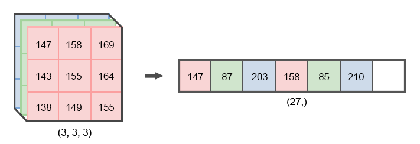

Обработчики
+++++++++++

Изображения
===========

.. note::
    При чтении одноканальные изображения автоматически переводятся в трёхканальные.

width
------
Целочисленное значение ширины картинки при создании массивов.

height
------
Целочисленное значение высоты картинки при создании массивов.

network
-------
.. На выбор доступно два режима - ``Convolutional`` и ``Linear``.

Режим ``Convolutional`` не предполагает никаких операций с полученным после чтения изображения массивом.

Режим ``Linear`` предполагает перевод массива изображения в векторное представление.
Например, трёхканальное изображение 100х100 из массива с размерностью (100, 100, 3) превратится в (30000,).

.. note::
    После перевода массивов изображения в векторное представление нельзя будет использовать сверточный слой в качестве первого слоя в нейронной сети.

.. _imageMode:

process
-----------------
Режим ``Stretch`` подгоняет исходное изображение под заданную высоту и ширину, не сохраняя её пропорции.

Режим ``Fit`` подгоняет исходное изображение под заданную высоту и ширину с сохранением пропорций исходного изображения.
Если заданные параметры высоты или ширины оказались больше исходного изображения, лишнее пространство изображения заполняется чёрным цветом.

Режим ``Cut`` подгоняет исходное изображение под заданную высоту и ширину, обрезая невошедшее в рамки заданной ширины и высоты исходя из центра изображения.
Если исходное изображение оказалось меньше заданной высоты и ширины, или одна из её сторон оказалась меньше, лишнее пространство изображения заполняется чёрным цветом.

.. list-table:: Режимы изображения. Размер обработанных картинок - 500х500px
    :widths: 300, 300, 300
    :header-rows: 1

    * - Растянуть
      - Вписать
      - Обрезать

    * - .. figure:: images/изображения_цветок_растянуть.png
          :alt: изображения_цветок_растянуть.png
          :align: center

          Оригинал - 300х200px

      - .. figure:: images/изображения_цветок_вписать.png
          :alt: изображения_цветок_растянуть.png
          :align: center

          Оригинал - 300х200px

      - .. figure:: images/изображения_цветок_обрезать.png
          :alt: изображения_цветок_растянуть.png
          :align: center

          Оригинал - 300х200px

    * - .. figure:: images/изображения_жираф_растянуть.png
          :alt: изображения_цветок_растянуть.png
          :align: center

          Оригинал - 600х950px

      - .. figure:: images/изображения_жираф_вписать.png
          :alt: изображения_цветок_растянуть.png
          :align: center

          Оригинал - 600х950px

      - .. figure:: images/изображения_жираф_обрезать.png
          :alt: изображения_цветок_растянуть.png
          :align: center

          Оригинал - 600х950px

preprocessing
-------------
**MinMaxScaler**

В процессе обучения данный объект проводит поиск среди всех значений массивов с целью нахождения минимального и максимального значения.
В дальнейшем, при использовании скейлера для трансформирования массива, все элементы интерполируются в диапазоне между минимальным и максимальным значением и между 0 и 1.

.. list-table:: Пример трансформации вектора с использованием MinMaxScaler.
    :widths: 30, 30, 30, 30, 30, 30, 30, 30, 30, 30
    :header-rows: 1

    * - -3.96
      - -3.12
      - -2.44
      - -1.23
      - 0.33
      - 1.74
      - 3.54
      - 4.23
      - 5.12
      - 6.32

    * - 0.0
      - 0.08
      - 0.15
      - 0.27
      - 0.42
      - 0.55
      - 0.73
      - 0.80
      - 0.88
      - 1.0

**TerraImageScaler**

В процессе обучения данный объект проводит поиск среди всех значений массивов изображений с целью нахождения минимального и максимального значений *индивидуально для каждого пикселя и каждого из трёх RGB каналов*.
В дальнейшем, при использовании скейлера для трансформирования массивов изображений, все значения каждого пикселя по трём RGB каналам интерполируются в собственном диапазоне минимального и максимального значений между 0 и 1.

.. note::
    Использование данного скейлера с режимом сети ``Linear`` невозможно.

**None**

При выборе данного режима никаких трансформаций массивов происходить не будет.

.................................................................
